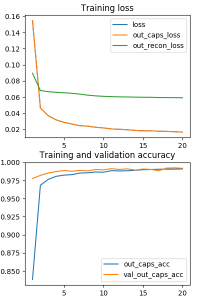
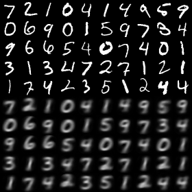
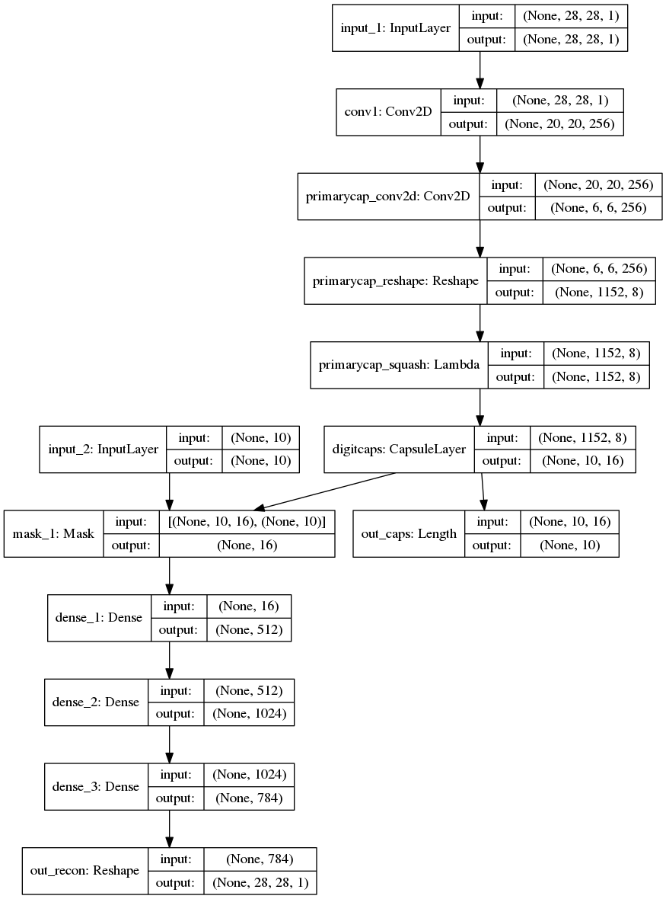

# CapsNet-Keras
[](https://github.com/XifengGuo/CapsNet-Keras/blob/master/LICENSE)

Now `Val_acc>99.5%`. A Keras implementation of CapsNet in the paper:   
[Sara Sabour, Nicholas Frosst, Geoffrey E Hinton. Dynamic Routing Between Capsules. NIPS 2017](https://arxiv.org/abs/1710.09829)

**Recent updates:**
- Released v0.1 to use. No frequent changes will be made.

**TODO**
- Keep debugging to improve the accuracy. The learning rate decay can be tuned.
- The model has 8M parameters, while the paper said it should be 11M.
I'll figure out what's the problem.
- It is time to do something with CapsuleNet...(LOL)

**Contribution**
- Your contribution to the repo is welcome. Open an issue or contact me with 
`guoxifeng1990@163.com` or WeChat (微信号) `wenlong-guo`.

## Requirements
- [Keras](https://github.com/fchollet/keras) 
- matplotlib

## Usage

### Training
**Step 1.**
Install Keras:

`$ pip install keras`

**Step 2.** 
Clone this repository with ``git``.

```
$ git clone https://github.com/xifengguo/CapsNet-Keras.git
$ cd CapsNet-Keras
```

**Step 3.** 
Training:
```
$ python capsulenet.py
```
Training with one routing iteration (default 3).   

`$ python capsulenet.py --num_routing 1`

Other parameters include `batch_size, epochs, lam_recon, shift_fraction, save_dir` can 
passed to the function in the same way. Please refer to `capsulenet.py`

### Testing

Suppose you have trained a model using the above command, then the trained model will be
saved to `result/trained_model.h5`. Now just launch the following command to get test results.
```
$ python capsulenet.py --is_training 0 --weights result/trained_model.h5
```
It will output the testing accuracy and show the reconstructed images.
The testing data is same as the validation data. It will be easy to test on new data, 
just change the code as you want (Of course you can do it!!!)

If sadly you do not have a good computer to train the model (sad face), you can *download
a model I trained* from https://pan.baidu.com/s/1hsF2bvY

## Results

**Main result**   
by launching `python capsulenet.py`:
The epoch=1 means the result is evaluated after training one epoch.
In the saved log file, it starts from 0.

   Epoch     |   1   |   5  |  10  |  15  |  20    
   :---------|:------:|:---:|:----:|:----:|:----:
   train_acc |  90.65| 98.95| 99.36| 99.63| 99.75 
   vali_acc  |  98.51| 99.30| 99.34| 99.49| 99.59
  
Losses and accuracies:   
 


**Results with one routing iteration**   
by launching `python CapsNet.py --num_routing 1`   

   Epoch     |   1   |   5  |  10  |  15  |  20    
   :---------|:------:|:---:|:----:|:----:|:----:
   train_acc |  89.64| 99.02| 99.42| 99.66| 99.73 
   vali_acc  |  98.55| 99.33| 99.43| 99.57| 99.58
   

Every epoch consumes about `110s` on a single GTX 1070 GPU.   

***NOTE:*** The training is still under-fitting, welcome to try for your own.   
The learning rate decay is not fine-tuned, I just tried this one. You can tune this.

**Testing result**   
The result by launching   
`python capsulenet.py --is_training 0 --weights result/trained_model.h5`   


**The model structure:**   


## Other Implementations
- Kaggle (this version as self-contained notebook):
  - [MNIST Dataset](https://www.kaggle.com/kmader/capsulenet-on-mnist) running on the standard MNIST and predicting for test data
  - [MNIST Fashion](https://www.kaggle.com/kmader/capsulenet-on-fashion-mnist) running on the more challenging Fashion images.
- TensorFlow:
  - [naturomics/CapsNet-Tensorflow](https://github.com/naturomics/CapsNet-Tensorflow.git)   
  Very good implementation. I referred to this repository in my code.
  - [InnerPeace-Wu/CapsNet-tensorflow](https://github.com/InnerPeace-Wu/CapsNet-tensorflow)   
  I referred to the use of tf.scan when optimizing my CapsuleLayer.
  - [LaoDar/tf_CapsNet_simple](https://github.com/LaoDar/tf_CapsNet_simple)

- PyTorch:
  - [nishnik/CapsNet-PyTorch](https://github.com/nishnik/CapsNet-PyTorch.git)
  - [timomernick/pytorch-capsule](https://github.com/timomernick/pytorch-capsule)
  - [gram-ai/capsule-networks](https://github.com/gram-ai/capsule-networks)
  - [andreaazzini/capsnet.pytorch](https://github.com/andreaazzini/capsnet.pytorch.git)
  - [leftthomas/CapsNet](https://github.com/leftthomas/CapsNet)
  
- MXNet:
  - [AaronLeong/CapsNet_Mxnet](https://github.com/AaronLeong/CapsNet_Mxnet)
  
- Lasagne (Theano):
  - [DeniskaMazur/CapsNet-Lasagne](https://github.com/DeniskaMazur/CapsNet-Lasagne)

- Chainer:
  - [soskek/dynamic_routing_between_capsules](https://github.com/soskek/dynamic_routing_between_capsules)
